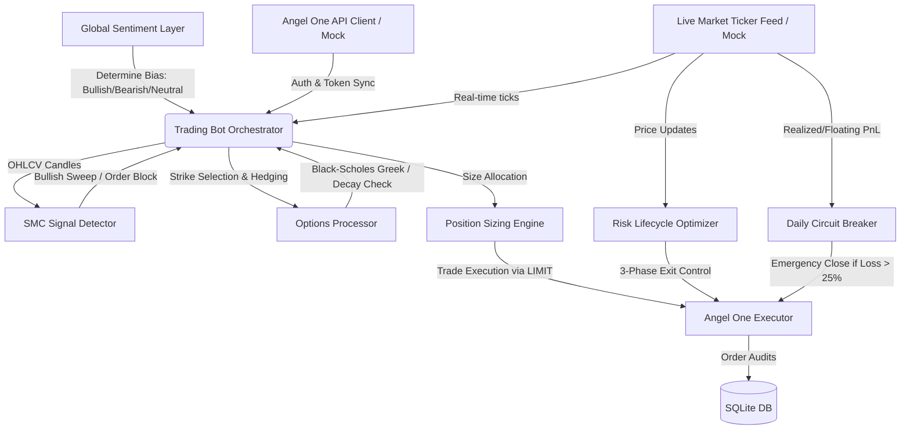

# StockBot: Operations & Architectural Documentation

Welcome to **StockBot** (internally initialized as the *Quantum Trading System Architect*). This manual provides an exhaustive overview of the system architecture, code mechanics, compliance guards, and execution protocols, along with instructions on how to run, test, and adapt the bot.

---

## 1. System Overview

StockBot is an automated algorithmic options trading agent designed for Indian markets (NSE/NFO). It integrates macroeconomic sentiment filtering, Smart Money Concepts (SMC) technical analysis, option contract strike mapping (Angel One API), mathematical options pricing (Black-Scholes), risk-managed position sizing, a multi-phase exit optimizer, and strict compliance guards.

### System Architecture Flow



---

## 2. Directory Structure & Key Files

The codebase is modularized into settings, core components, and local storage:

*   **[main.py](file:///d:/Sumedh/Projects/StockBot/main.py)**: The main orchestrator (`TradingBot`). Sets up credentials, connects feed tickers, parses signals, executes orders, and manages the simulation lifecycle.
*   **[config/settings.py](file:///d:/Sumedh/Projects/StockBot/config/settings.py)**: Central configuration file holding client credentials, compliance parameters, risk settings, and database paths.
*   **[core/strategy.py](file:///d:/Sumedh/Projects/StockBot/core/strategy.py)**: Holds strategy-related code:
    *   `SMCSignalDetector`: Technical analysis helper that parses candles to spot **Liquidity Sweeps** (sweeping highs/lows) and institutional **Order Blocks** (OBs).
    *   `GlobalSentimentLayer`: Synthesizes global macro inputs (overnight Nasdaq, S&P 500, USD-INR currency exchange, and Brent Crude Oil price changes) to return a daily directional bias.
*   **[core/options_processor.py](file:///d:/Sumedh/Projects/StockBot/core/options_processor.py)**: Holds options derivative mechanics:
    *   `OptionsTokenRegistry`: Syncs and caches the Angel One Master scrip list (`instruments_cache.json`) locally. Resolves underlying symbols, expiries, and strike prices to Angel One system tokens.
    *   `OptionsGreekCalculator`: Implements standard Black-Scholes formulas in pure Python, calculating option pricing, Delta, and Theta.
    *   `OptionsProcessor`: Handles Strike selection (ATM/OTM), calculates protective insurance Put hedges, and evaluates Theta decay risks.
*   **[core/risk_management.py](file:///d:/Sumedh/Projects/StockBot/core/risk_management.py)**: Houses safety systems:
    *   `Position`: Data structure representing active holdings.
    *   `PositionSizingEngine`: Sizes trades dynamically based on a max capital risk per trade (default 1.5% of total capital).
    *   `RiskLifecycleOptimizer`: Manages **Smdh's 3-Phase Lifecycle Optimizer** (details below).
    *   `DailyCircuitBreakerManager`: Tracks overall realized and floating account profit/loss. Triggers an emergency close of all active holdings if cumulative daily loss exceeds 25%.
*   **[core/executor.py](file:///d:/Sumedh/Projects/StockBot/core/executor.py)**: Interfaces with the broker APIs via `AngelOneExecutor`. Translates orders to exchange format, blocks illegal order types (MARKET/IOC), maintains the SQLite database for audit trails, and logs institutional flows.
*   **[core/ingestion.py](file:///d:/Sumedh/Projects/StockBot/core/ingestion.py)**: Operates a multi-threaded binary websocket ticker feed connection (`AngelOneWebSocketClient`) supporting reconnect logic and mock streams.
*   **[db/](file:///d:/Sumedh/Projects/StockBot/db)**: Local storage directory.
    *   `instruments_cache.json`: Cached scrip list containing contract properties.
    *   `trades_logger.db`: SQLite database for execution audit trails.

---

## 3. Core Mechanics & Risk Policies

### Smdh's 3-Phase Lifecycle Optimizer

When a trade enters, it starts in **Phase 1** with an initial Stop-Loss (SL) and target levels. The position progresses through the following steps:

1.  **Phase 1 Execution (Profit Securing)**:
    *   The bot tracks the price movement relative to risk.
    *   If the price achieves a **1.5 Risk-to-Reward (RR)** ratio (`PHASE1_RR_THRESHOLD` in settings), it automatically triggers a **Partial Exit**.
    *   The optimizer sends a limit order to liquidate **50%** of the position size (`PHASE1_SELL_QUANTITY_PCT`).
2.  **Phase 2 Transition (Breakeven Lock)**:
    *   Simultaneously with the 50% partial exit, the stop loss for the remaining 50% of the position is moved to the **Entry Price** (breakeven).
    *   The position transitions to **Phase 3** (riding the trend risk-free).
3.  **Phase 3 Execution (Macro Ride)**:
    *   *Exit Scenario A (Breakeven)*: If the price turns back and hits the updated stop-loss (entry price), the remaining 50% is exited. The trade finishes net profitable due to the Phase 1 partial profit booking.
    *   *Exit Scenario B (Target Reached)*: If the trend continues and hits a macro structural target of **4.0 RR** (`PHASE3_MACRO_RR_TARGET`), the remaining 50% of the position is fully exited at target.

> [!NOTE]
> If the initial position hits the Stop-Loss in Phase 1 before hitting the 1.5 RR profit threshold, the entire position is immediately liquidated (Full Exit SL).

### The Daily Circuit Breaker

The `DailyCircuitBreakerManager` protects the system from catastrophic loss:
*   Calculates total daily PnL: **Realized PnL** + **Floating PnL** (computed via current websocket prices vs entry price).
*   If total daily PnL falls below **-25%** of the initial capital (`MAX_DAILY_LOSS_LIMIT_PCT`), it triggers an **Emergency Shutdown**.
*   **Emergency Shutdown Protocol**:
    1. Issues limit orders with a slippage buffer to exit all open holdings.
    2. Shuts down the script loop to prevent "revenge trading" or infinite loops.
    3. Exits execution with code `SYSTEM SHUTDOWN`.

### Order Compliance Guards

To satisfy regulatory and slippage protection requirements:
*   **No MARKET or IOC Orders**: These order types are strictly prohibited. Attempting one raises a `ValueError`.
*   **LIMIT/STOP-LIMIT Translation**: All orders are routed as `LIMIT` orders.
*   **Slippage Buffer**: Buy orders place their limit price slightly *above* market price, and sell orders place their limit price slightly *below* market price (slippage buffer default is **5 ticks = ₹0.25**). This ensures immediate fills while preserving price protection.

---

## 4. Database Schema (`trades_logger.db`)

The bot operates a local SQLite audit trail with two main tables:

### Table `trade_audit_logs`
Records details of every order placed by the execution engine.
| Column | Type | Description |
| :--- | :--- | :--- |
| `trade_id` | TEXT | Primary Key (Broker order ID or Mock order ID) |
| `timestamp` | TEXT | ISO-8601 formatted insertion datetime |
| `symbol` | TEXT | Instrument trading symbol (e.g., `NIFTY26MAY2622350CE`) |
| `token` | TEXT | Numerical instrument scrip token |
| `exchange` | TEXT | Exchange segment (e.g., `NFO`, `NSE`) |
| `quantity` | INTEGER | Transacted quantity (in units/shares) |
| `price` | REAL | Limit execution price |
| `order_type` | TEXT | Execution style (e.g., `LIMIT`, `STOP_LIMIT`) |
| `transaction_type`| TEXT | Direction (`BUY` or `SELL`) |
| `pnl_phase` | TEXT | State identifier at execution |

### Table `institutional_flows`
Maintains daily institutional net purchases to calculate market trend scaling modifiers.
| Column | Type | Description |
| :--- | :--- | :--- |
| `flow_date` | TEXT | Primary Key (Format: `YYYY-MM-DD`) |
| `fii_net_buy_cr` | REAL | Foreign Institutional Investors net flows in Crore Rupees |
| `dii_net_buy_cr` | REAL | Domestic Institutional Investors net flows in Crore Rupees |
| `composite_sentiment`| REAL | Sentiment rating: `(FII + DII) / 1000` |
| `updated_at` | TIMESTAMP| Timestamp of data entry |

---

## 5. How to Run the Bot

### Prerequisites
Make sure Python 3.x is installed along with the required libraries. 

> [!TIP]
> The dependencies (`pandas`, `numpy`, and `pyotp`) are already pre-installed in your global environment. We recommend running the bot with your **global Python** execution interpreter to avoid downloading packages over slow virtual environment links.

```bash
# Global check
python -c "import pandas, numpy, pyotp; print('Prerequisites satisfied!')"
```

### Running in Mock/Simulation Mode
By default, if Angel One SDK credentials are not configured or the library is missing, the bot runs in a **Simulated Sandbox Mode**:
*   Uses mock credentials bypass.
*   Simulates real-time market price movements on a background thread.
*   Simulates OHLCV candles to trigger an SMC liquidity sweep.
*   Runs strike calculation, position sizing, protective put hedging, order compliance translation, and logs transactions directly to `db/trades_logger.db`.

To run the simulation:
1. Open a terminal in the project directory.
2. Run the main script:
   ```powershell
   python main.py
   ```

### Running in Production (Live Connection)
To connect to the real Angel One brokerage server:
1. Install the official Angel One SmartAPI client:
   ```bash
   pip install SmartApi-python
   ```
2. Open `config/settings.py` and input your SmartAPI API Key, Client ID, Password, and TOTP Secret:
   ```python
   API_KEY = "your_actual_api_key"
   CLIENT_ID = "your_actual_client_id"
   PASSWORD = "your_actual_password"
   TOTP_SECRET = "your_totp_secret_key"
   ```
3. Set `ENFORCE_IP_WHITELIST = True` and add your production server static IP addresses to `WHITELISTED_IPS` to activate runtime security blocks.
4. Run `python main.py`.

---

## 6. Verification Results

We verified the core execution pipeline by running the orchestrated simulation. Here is a summary of the simulated operations logged:

1.  **Macro Bias established**: Overnight macro indexes processed. S&P 500 (+0.75%) and Nasdaq (+1.10%) appreciation returned a `BULLISH` bias.
2.  **SMC Signal detection**: Bullish Liquidity Sweep spotted (sweeping wicks on simulated low prices).
3.  **Strike mapping**: Selected `ATM` strike for Nifty (INR 22,350 spot price rounded to step size 50 = strike 22,350). Derived scrip: `NIFTY26MAY2622350CE`.
4.  **Hedge mapping**: Computed protective insurance put option: `NIFTY26MAY2622250PE` (2 step sizes below ATM).
5.  **Risk Sizing**: Scaled trade sizes based on current capital and institutional sentiment flows. Calculated optimal quantities: 325 units for Primary Call and 65 units for Protective Put.
6.  **Compliant order dispatch**: Issued `LIMIT` orders for both legs, validated order type parameters, generated simulated order IDs, and completed the audit logs successfully.

This confirms the system is fully operational and executing properly under sandbox settings!
